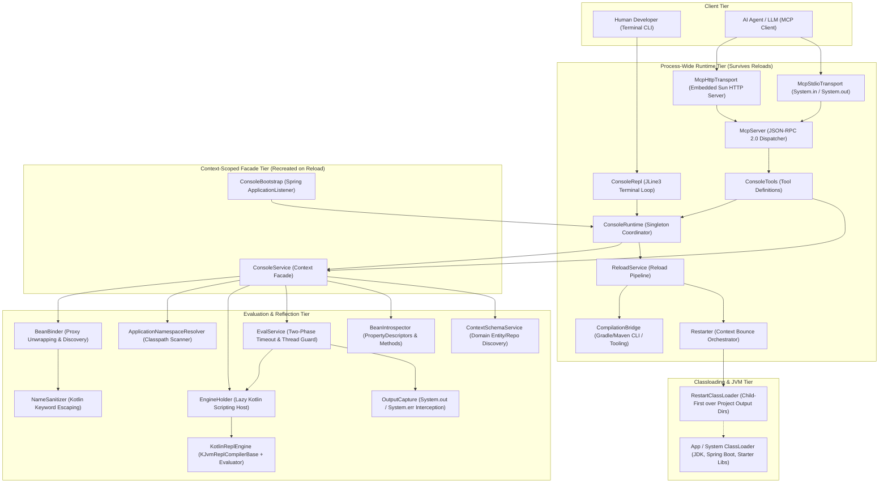
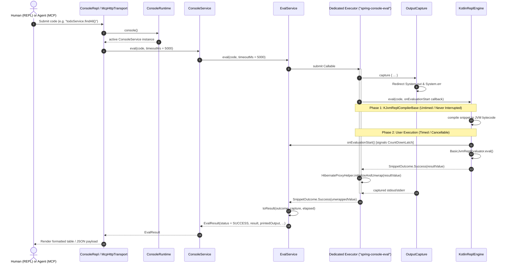
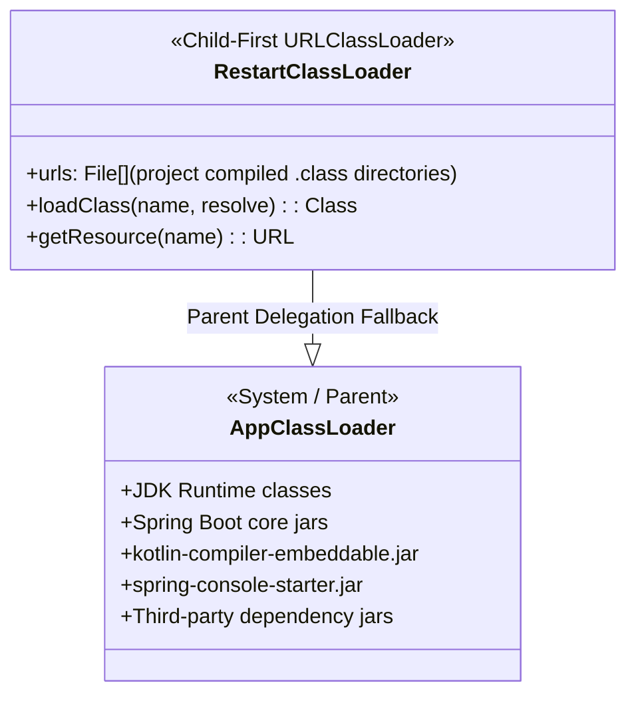
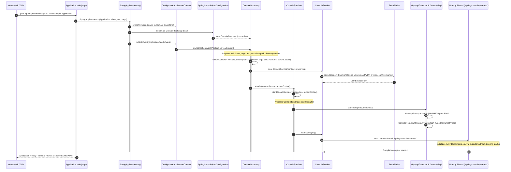
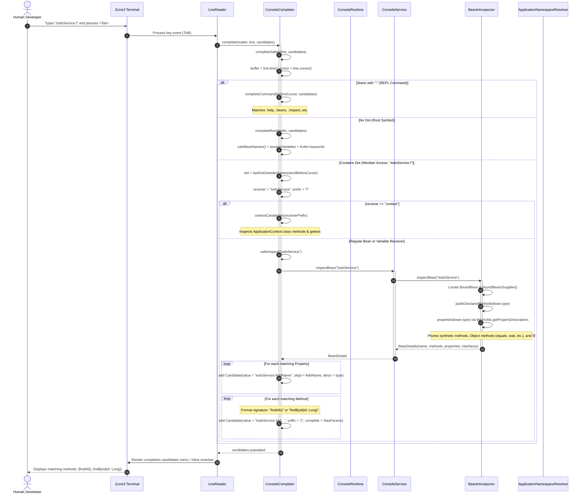
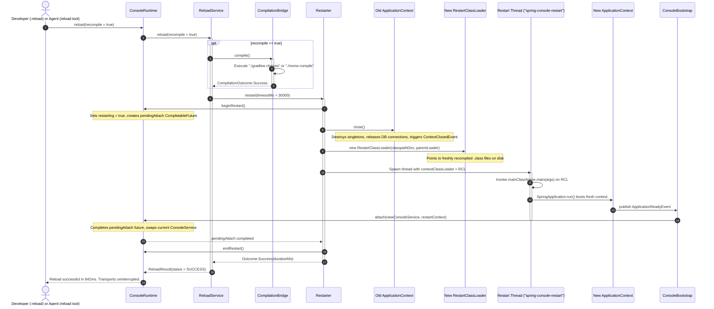

# Architecture & Technical Design: Spring Console

> **Embedded Kotlin REPL & Model Context Protocol (MCP) Server for Spring Boot**

This document details the internal architecture, component interactions, classloading mechanics, boot sequence, and auto-completion pipeline of `spring-console`.

---

## 1. Executive Summary & Design Principles

`spring-console` embeds an interactive Kotlin REPL and an MCP server directly into a running Spring Boot application process. It turns the live Spring `ApplicationContext` into an interactive, executable sandbox for both human developers (via an interactive JLine3 CLI) and autonomous AI agents (via JSON-RPC 2.0 over HTTP or stdio).

### Core Architectural Invariants

1. **Symmetric Execution**: AI agents and human engineers share the exact same runtime facade ([`ConsoleService`](file:///Users/jakob/Workspace/spring-console/spring-console-starter/src/main/kotlin/io/github/springconsole/ConsoleService.kt)). Any evaluation, bean inspection, or schema discovery behaves identically regardless of the entry transport.
2. **Lifecycle Outside the Context**: Transports (HTTP server, stdio, terminal REPL) and reload orchestration live in a process-wide singleton ([`ConsoleRuntime`](file:///Users/jakob/Workspace/spring-console/spring-console-starter/src/main/kotlin/io/github/springconsole/ConsoleRuntime.kt)) **outside** the Spring `ApplicationContext`. When a reload occurs, the Spring context is destroyed and rebuilt in-process, but transports survive to deliver the result to the caller.
3. **Direct Execution with Permanent Consequences**: Code evaluations execute directly against the live Spring context and services. There is no rollback sandbox; mutations, database writes, and service calls have immediate and permanent consequences. Transactions are managed by Spring's standard demarcation (`@Transactional` annotations on services and repositories).
4. **Compiler Thread-Affinity & Poisoning Prevention**: The runtime Kotlin scripting compiler (`KJvmReplCompilerBase`) is strictly thread-affine and cannot tolerate thread interruption. Bytecode compilation runs on a dedicated single-threaded executor (`spring-console-eval`). Thread timeouts are partitioned into two phases: compilation is never interrupted (preventing closed NIO jar channels), while user-code execution is safely interruptible.
5. **Zero Side-Effect Autocomplete**: Tab completion answers candidates purely from reflection and static metadata via [`BeanIntrospector`](file:///Users/jakob/Workspace/spring-console/spring-console-starter/src/main/kotlin/io/github/springconsole/introspect/BeanIntrospector.kt). It never evaluates code or triggers proxy invocations (e.g. avoiding premature database fetches or Hibernate session initializations).

---

## 2. High-Level Subsystem Architecture

The system is structured into five distinct operational tiers:

### Core Subsystem Responsibilities

| Component | Responsibility |
|---|---|
| [`ConsoleRuntime`](file:///Users/jakob/Workspace/spring-console/spring-console-starter/src/main/kotlin/io/github/springconsole/ConsoleRuntime.kt) | Process-wide singleton. Maintains current `ConsoleService`, manages transports, and coordinates reloads. |
| [`ConsoleBootstrap`](file:///Users/jakob/Workspace/spring-console/spring-console-starter/src/main/kotlin/io/github/springconsole/autoconfigure/SpringConsoleAutoConfiguration.kt) | Spring `ApplicationListener`. Listens for `ApplicationReadyEvent` and `ContextClosedEvent` to attach/detach the context to `ConsoleRuntime`. |
| [`ConsoleService`](file:///Users/jakob/Workspace/spring-console/spring-console-starter/src/main/kotlin/io/github/springconsole/ConsoleService.kt) | Context-scoped unified facade. Coordinates script engine instantiation, bean binding, introspection, and schema generation. |
| [`ConsoleRepl`](file:///Users/jakob/Workspace/spring-console/spring-console-starter/src/main/kotlin/io/github/springconsole/repl/ConsoleRepl.kt) | JLine3-based interactive terminal loop. Wires syntax highlighting, autocomplete, history, and rendering. |
| [`McpServer`](file:///Users/jakob/Workspace/spring-console/spring-console-starter/src/main/kotlin/io/github/springconsole/mcp/McpServer.kt) | Implements Model Context Protocol (JSON-RPC 2.0) with tools `eval`, `list_beans`, `inspect_bean`, `get_context_schema`, and `reload`. |
| [`KotlinReplEngine`](file:///Users/jakob/Workspace/spring-console/spring-console-starter/src/main/kotlin/io/github/springconsole/engine/KotlinReplEngine.kt) | Integrates `kotlin-scripting-jvm-host`. Maintains persistent snippet state and handles bytecode generation. |
| [`BeanBinder`](file:///Users/jakob/Workspace/spring-console/spring-console-starter/src/main/kotlin/io/github/springconsole/binding/BeanBinder.kt) | Scans Spring singleton registry, unwraps Spring AOP/CGLIB proxies and JDK dynamic proxies, sanitizing names for Kotlin syntax. |
| [`ApplicationNamespaceResolver`](file:///Users/jakob/Workspace/spring-console/spring-console-starter/src/main/kotlin/io/github/springconsole/binding/ApplicationNamespaceResolver.kt) | Dynamically scans classes across compilation directories and packages to register automatic unambiguous imports in REPL snippets. |
| [`ConsoleCompleter`](file:///Users/jakob/Workspace/spring-console/spring-console-starter/src/main/kotlin/io/github/springconsole/repl/ConsoleCompleter.kt) | Non-evaluating JLine3 tab completer for commands, bound beans, session variables, keywords, and member properties/methods. |
| [`RestartClassLoader`](file:///Users/jakob/Workspace/spring-console/spring-console-starter/src/main/kotlin/io/github/springconsole/reload/RestartClassLoader.kt) | Child-first URLClassLoader loading freshly recompiled classes from disk directories while delegating third-party JARs to parent. |

---

## 3. Class Interactions: Evaluation & Query Pipeline

When a human user or an AI agent submits code to be evaluated, execution flows directly through a unified pipeline with permanent consequences.

---

## 4. Bootstrapping, Classloading, and Classpaths

### 4.1 The Exploded Classpath Requirement

The runtime Kotlin scripting compiler (`KJvmReplCompilerBase`) is an embedded compiler. To compile Kotlin snippets referencing project classes and dependencies, it requires **direct filesystem access** to `.class` directories and `.jar` archives.

- **Standard Spring Boot Fat JARs**: A flat `bootJar` nests dependencies under `BOOT-INF/lib/*.jar` and compiled classes under `BOOT-INF/classes/`. The runtime compiler cannot traverse nested JAR URLs through Java NIO zip providers without extracting them, resulting in `Unable to find kotlin stdlib` or missing class errors.
- **Exploded Classpath**: When launched via [`console.sh`](file:///Users/jakob/Workspace/spring-console/scripts/console.sh) or Gradle's `writeRuntimeClasspath`, Gradle resolves all dependencies into an exploded file list passed to `java -cp`:
  - Project class directories: `build/classes/java/main`, `build/classes/kotlin/main`
  - Third-party JAR files: `~/.gradle/caches/modules-2/files-2.1/...`

### 4.2 Two-Tier Classloader Hierarchy

To support in-process hot reload without restarting the JVM, `spring-console` adopts a classloader hierarchy inspired by Spring Boot DevTools:

1. **AppClassLoader (Parent / Stable)**: Loads the JDK, Spring Boot framework classes, third-party libraries, the Kotlin compiler, and the process-wide `ConsoleRuntime`. It is created once when the JVM boots and never discarded.
2. **RestartClassLoader (Child / Ephemeral)**: A child-first classloader pointing to the application's compiled class directories. When loading classes:
   - It checks `findLoadedClass(name)`.
   - It attempts child-first `findClass(name)` against the compiled directory URLs so newly built `.class` files always win.
   - If not found in the project directories, it delegates to `super.loadClass(name)` (AppClassLoader).

### 4.3 Sequence Diagram: Application Cold Boot & Console Initialization

---

## 5. Autocomplete Subsystem & Tab Completion

The REPL autocomplete feature is powered by [`ConsoleCompleter`](file:///Users/jakob/Workspace/spring-console/spring-console-starter/src/main/kotlin/io/github/springconsole/repl/ConsoleCompleter.kt) (implementing JLine3's `Completer` interface). It operates inside the terminal event loop and provides intelligent completion for:

1. **Commands**: `:help`, `:beans`, `:inspect`, `:schema`, `:reload`, `:quit`.
2. **Command Arguments**: Bean names for `:inspect <Tab>`.
3. **Root Identifiers**: Bound bean REPL names (e.g. `todoService`), session variables (`val`/`var`/`fun` declared in previous snippets), and Kotlin keywords.
4. **Member Expressions (`receiver.member`)**:
   - `context.<Tab>`: Reflective methods and synthetic JavaBean properties of Spring's `ApplicationContext`.
   - `bean.<Tab>`: Introspected properties and public declared methods of the target bean.
   - `variable.<Tab>`: Methods and properties of previously declared session variables.

### 5.1 Safety Guarantees

- **No Code Evaluation**: Tab completion never invokes user code or getters. It queries the cached [`BeanDetails`](file:///Users/jakob/Workspace/spring-console/spring-console-starter/src/main/kotlin/io/github/springconsole/api/Results.kt) model produced by reflection in [`BeanIntrospector`](file:///Users/jakob/Workspace/spring-console/spring-console-starter/src/main/kotlin/io/github/springconsole/introspect/BeanIntrospector.kt).
- **Never Throws**: The entire completion pipeline is wrapped in `try-catch` blocks catching both `Exception` and `LinkageError`, ensuring terminal input never locks up even if optional library classes are missing.
- **Immediate Dot Completion**: A custom JLine widget (`dot-complete`) is bound to the `.` key. Whenever the user finishes typing a known bean or variable name and hits `.`, candidate options are presented instantly without requiring an extra `<Tab>` keystroke.

### 5.2 Sequence Diagram: Autocomplete Workflow

---

## 6. In-Process Hot Reload Pipeline

The `:reload` command and the `reload(recompile: Boolean)` MCP tool allow both developers and AI agents to update source code, recompile, and bounce the Spring context without restarting the JVM:

---

## 7. Security & Execution Boundaries
 
1. **Permanent Consequences & Standard Transaction Demarcation**:
   - Every execution run via `eval` executes directly against the target Spring Boot application with permanent consequences.
   - There is no transactional rollback sandbox; mutations, database updates, and service methods run and commit as configured in the host application.
   - Service-layer transaction boundaries (e.g. `@Transactional`) operate normally via their Spring proxies.
2. **Timeout Enforcement**:
   - Snippet compilation phase has a high watchdog timeout (120s) and is **never interrupted** to preserve the JVM's classpath JAR file handles.
   - User evaluation phase enforces the configured timeout (`defaultTimeoutMs = 5000ms`), interrupting runaway loops safely.
   - If a thread ignores interruption, the executor is abandoned, a fresh evaluation thread is spawned, and the REPL session state is cleared to avoid compiler IR poisoning (`psi2ir` corruption).
3. **Identifier Sanitization**:
   - `NameSanitizer` cleans bean identifiers containing characters like `-`, `/`, or `.`.
   - Kotlin reserved keywords (e.g. `val`, `fun`, `class`, `package`) are escaped with backticks or suffixed deterministically (`class_`), preventing syntax errors during scripting compilation.
