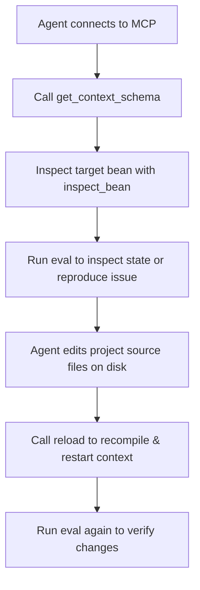

# Spring Console — Model Context Protocol (MCP) Guide

This document describes how to connect AI agents (Claude Desktop, Cursor, Antigravity, custom agents) and automation tools to a running Spring Boot application using the embedded **Model Context Protocol (MCP)** server provided by `spring-console`.

---

## 1. Overview & Architecture

`spring-console` embeds an in-process MCP server directly alongside the running Spring Boot application. AI agents interact with the live `ApplicationContext` using the same symmetrical engine and bean bindings that developers use in the interactive terminal REPL.

```
 AI Agent (Claude / Cursor / Antigravity)              Developer Terminal
                    │                                          │
                    ▼                                          ▼
     ┌──────────────────────────────┐                ┌──────────────────┐
     │ MCP Server (JSON-RPC 2.0)    │                │ JLine3 REPL      │
     │ Streamable HTTP (Port 8085)  │                │ Syntax, tab      │
     │ or stdio transport           │                │ completion       │
     └──────────────┬───────────────┘                └────────┬─────────┘
                    └───────────────────┬─────────────────────┘
                                        ▼
                          ┌───────────────────────────┐
                          │ ConsoleService Facade     │
                          └─────────────┬─────────────┘
                                        ▼
             ┌─────────────────────────────────────────────────────┐
             │ Kotlin Scripting Engine (eval)                      │
             │ Bean Discoverer & Proxy Unwrapper                   │
             │ Build Bridge & Hot Restarter (reload)               │
             └─────────────────────────────────────────────────────┘
```

### Key Characteristics
* **Symmetrical Capabilities:** All beans and tools accessible to a human in the terminal REPL are available as deterministic MCP tools to an AI agent.
* **Direct Execution with Permanent Consequences:** Code executed via the `eval` tool runs directly against the live Spring context, modifying databases and application state permanently.
* **Isolated Transport Lifecycle:** The HTTP MCP transport runs on an internal JDK `HttpServer` decoupled from both Spring's web container and the Spring `ApplicationContext` lifecycle. Triggering a context reload (`reload`) leaves the HTTP socket open and the agent connected.

---

## 2. Endpoints & Transport Protocols

`spring-console` supports three transport modes: **Streamable HTTP POST**, **Server-Sent Events (SSE)**, and **stdio**.

### 2.1 HTTP & SSE Transport (Default)

The HTTP transport listens on `http://127.0.0.1:8085/mcp` and automatically negotiates between Streamable HTTP and SSE based on the client's request:

| Setting | Default Value | Property Key |
| :--- | :--- | :--- |
| **Endpoint URL** | `http://127.0.0.1:8085/mcp` | `spring-console.mcp.path` |
| **Host / Interface** | `127.0.0.1` (loopback only) | `spring-console.mcp.host` |
| **Port** | `8085` | `spring-console.mcp.port` |
| **Path** | `/mcp` | `spring-console.mcp.path` |
| **Protocols** | **SSE:** `GET` with `Accept: text/event-stream`<br>**Streamable HTTP:** `POST` with `Content-Type: application/json` | |

#### Transport Details
* **SSE (Server-Sent Events):** When an MCP host (such as Antigravity, Claude, or Cursor configured with `serverUrl`) opens a `GET` connection with `Accept: text/event-stream`, the server initiates an SSE session, streams an `endpoint` event with the session POST URL (`/mcp?sessionId=...`), and streams `message` events for all JSON-RPC responses.
* **Streamable HTTP POST:** Direct JSON-RPC `POST` requests without an SSE session receive their response inline with HTTP 200 (or HTTP 202 for notifications).
* **Security & Access Control:**
  * **Loopback only:** The console executes arbitrary Kotlin bytecode and is bound to `127.0.0.1` by default.
  * **DNS-Rebinding Protection & CORS:** Browser-originated requests are checked against an origin whitelist (`localhost`, `127.0.0.1`, `::1`). CORS response headers are included for allowed origins.
  * `DELETE /mcp?sessionId=...` cleanly terminates active SSE sessions.

### 2.2 Stdio Transport

For direct process spawning by local MCP desktop clients:
* Enable with `spring-console.mcp.stdio=true`.
* Takes over standard input and standard output (`stdin`/`stdout`).
* The interactive terminal REPL is automatically disabled in stdio mode, and all application logging should be routed to a file or `stderr`.

---

## 3. Configuring MCP Clients

### 3.1 Claude Desktop

Add `spring-console` to your Claude Desktop configuration (`claude_desktop_config.json`):

#### Option A: HTTP Transport (Recommended when app is already running)
```json
{
  "mcpServers": {
    "spring-console": {
      "url": "http://127.0.0.1:8085/mcp"
    }
  }
}
```

#### Option B: Stdio Transport (Launches application as a subprocess)
```json
{
  "mcpServers": {
    "spring-console": {
      "command": "/path/to/spring-console/scripts/console.sh",
      "args": [
        "--spring-console.mcp.stdio=true",
        "--spring.main.web-application-type=none"
      ]
    }
  }
}
```

### 3.2 Cursor / Antigravity / Other MCP Hosts

Configure an HTTP-based MCP server pointing to the URL:
```text
http://127.0.0.1:8085/mcp
```

---

## 4. MCP Tools Reference

The server exposes 5 core tools via the standard MCP `tools/list` and `tools/call` protocol methods.

### 4.1 `eval`
Executes an arbitrary Kotlin snippet directly against the live `ApplicationContext`.
* All Spring beans are pre-bound as typed variables (e.g. `todoService`, `userRepository`).
* `context` is pre-bound as the Spring `ApplicationContext`.
* Variable declarations (`val`, `var`, `fun`) are preserved across sequential `eval` calls within the same session.
* All mutations persist permanently.

#### Parameters
| Parameter | Type | Required | Default | Description |
| :--- | :--- | :--- | :--- | :--- |
| `code` | `string` | **Yes** | — | Kotlin code snippet to execute |
| `timeoutMs` | `integer` | No | `5000` | Max user-code execution timeout in ms (compilation time is excluded) |

#### Example Request
```json
{
  "jsonrpc": "2.0",
  "id": 1,
  "method": "tools/call",
  "params": {
    "name": "eval",
    "arguments": {
      "code": "todoService.findAll().map { it.title }"
    }
  }
}
```

#### Example Response
```json
{
  "jsonrpc": "2.0",
  "id": 1,
  "result": {
    "content": [
      {
        "type": "text",
        "text": "{\n  \"status\" : \"SUCCESS\",\n  \"result\" : \"[Try the spring-console REPL, Connect an AI agent over MCP]\",\n  \"printedOutput\" : \"\",\n  \"executionTimeMs\" : 14\n}"
      }
    ]
  }
}
```

---

### 4.2 `list_beans`
Discovers all registered beans in the `ApplicationContext` with their resolved (unproxied) types and the sanitized variable names they are bound to in `eval`.

#### Parameters
| Parameter | Type | Required | Default | Description |
| :--- | :--- | :--- | :--- | :--- |
| `packageFilter` | `string` | No | `null` | Package prefix filter (e.g. `com.example.todo`) |
| `includeProxies` | `boolean` | No | `false` | If true, reports the raw proxy class name instead of unwrapping |

#### Example Request
```json
{
  "jsonrpc": "2.0",
  "id": 2,
  "method": "tools/call",
  "params": {
    "name": "list_beans",
    "arguments": {
      "packageFilter": "com.example.todo"
    }
  }
}
```

---

### 4.3 `inspect_bean`
Deep introspection of a single bean: resolved target class, interfaces implemented, public methods with exact signatures, and readable/writable properties.

#### Parameters
| Parameter | Type | Required | Default | Description |
| :--- | :--- | :--- | :--- | :--- |
| `beanName` | `string` | **Yes** | — | Spring bean name or REPL variable name |

#### Example Request
```json
{
  "jsonrpc": "2.0",
  "id": 3,
  "method": "tools/call",
  "params": {
    "name": "inspect_bean",
    "arguments": {
      "beanName": "todoService"
    }
  }
}
```

---

### 4.4 `reload`
Triggers the in-process compilation bridge (via `./gradlew classes` or `./mvnw compile`), tears down the child `RestartClassLoader`, closes the active Spring `ApplicationContext`, and instantiates a brand new application context inside the same running JVM.

#### Parameters
| Parameter | Type | Required | Default | Description |
| :--- | :--- | :--- | :--- | :--- |
| `recompile` | `boolean` | No | `true` | When true, runs an incremental build before reloading |

#### Example Request
```json
{
  "jsonrpc": "2.0",
  "id": 4,
  "method": "tools/call",
  "params": {
    "name": "reload",
    "arguments": {
      "recompile": true
    }
  }
}
```

#### Example Response
```json
{
  "jsonrpc": "2.0",
  "id": 4,
  "result": {
    "content": [
      {
        "type": "text",
        "text": "{\n  \"status\" : \"SUCCESS\",\n  \"message\" : \"Context refreshed in 1840ms\",\n  \"reloadDurationMs\" : 1840\n}"
      }
    ]
  }
}
```

---

### 4.5 `get_context_schema`
Dumps the complete domain architecture of the application:
* **JPA Entities:** Class names, table names, primary keys, fields, and relationships (`OneToMany`, `ManyToOne`, etc.).
* **Spring Data Repositories:** Repository interfaces, target entity types, and query method signatures.
* **Services:** Domain `@Service` beans and their declared public methods.

#### Parameters
*None.*

#### Example Request
```json
{
  "jsonrpc": "2.0",
  "id": 5,
  "method": "tools/call",
  "params": {
    "name": "get_context_schema",
    "arguments": {}
  }
}
```

---

## 5. Quick Testing with cURL

You can test the MCP server directly from your terminal:

### 1. Initialize Protocol Handshake
```bash
curl -X POST http://127.0.0.1:8085/mcp \
  -H "Content-Type: application/json" \
  -d '{
    "jsonrpc": "2.0",
    "id": 1,
    "method": "initialize",
    "params": {
      "protocolVersion": "2025-06-18",
      "capabilities": {},
      "clientInfo": { "name": "curl-test", "version": "1.0.0" }
    }
  }'
```

### 2. List All Available Tools
```bash
curl -X POST http://127.0.0.1:8085/mcp \
  -H "Content-Type: application/json" \
  -d '{
    "jsonrpc": "2.0",
    "id": 2,
    "method": "tools/list",
    "params": {}
  }'
```

### 3. Evaluate a Kotlin Expression
```bash
curl -X POST http://127.0.0.1:8085/mcp \
  -H "Content-Type: application/json" \
  -d '{
    "jsonrpc": "2.0",
    "id": 3,
    "method": "tools/call",
    "params": {
      "name": "eval",
      "arguments": {
        "code": "1 + 1"
      }
    }
  }'
```

---

## 6. Configuration Options

All settings are configured under the `spring-console.*` namespace in `application.yml` or `application.properties`:

```yaml
spring-console:
  enabled: true                    # Master switch for console & MCP
  eval-timeout-ms: 5000            # Default timeout for eval
  include-infrastructure-beans: false # Include org.springframework.* internal beans
  default-imports:                 # Packages automatically imported in eval snippets
    - com.example.domain.*
  mcp:
    enabled: true                  # Expose the MCP server
    host: 127.0.0.1                # Local interface only (security)
    port: 8085                     # MCP HTTP port
    path: /mcp                     # HTTP path
    stdio: false                   # Serve over stdio instead of HTTP
  reload:
    enabled: true                  # Enable in-process hot reload
    compile-timeout-ms: 120000     # Build timeout
    restart-timeout-ms: 60000      # Context restart timeout
```

---

## 7. Typical AI Agent Workflow

A standard autonomous loop for an AI agent using `spring-console`:



1. **Introspection:** Agent calls `get_context_schema` and `list_beans` to discover available entities, repositories, and services.
2. **Deep Inspection:** Agent calls `inspect_bean("todoService")` to verify exact method parameters and return types.
3. **Execution & Diagnosis:** Agent calls `eval` with a test snippet to inspect live data or reproduce an issue.
4. **Code Modification:** Agent modifies application source code files on disk.
5. **Hot Reload:** Agent calls `reload(recompile=true)`. The build tool compiles the source, and Spring restarts in-process in ~1.5 seconds.
6. **Verification:** Agent calls `eval` again to verify the fix directly against the running application.
